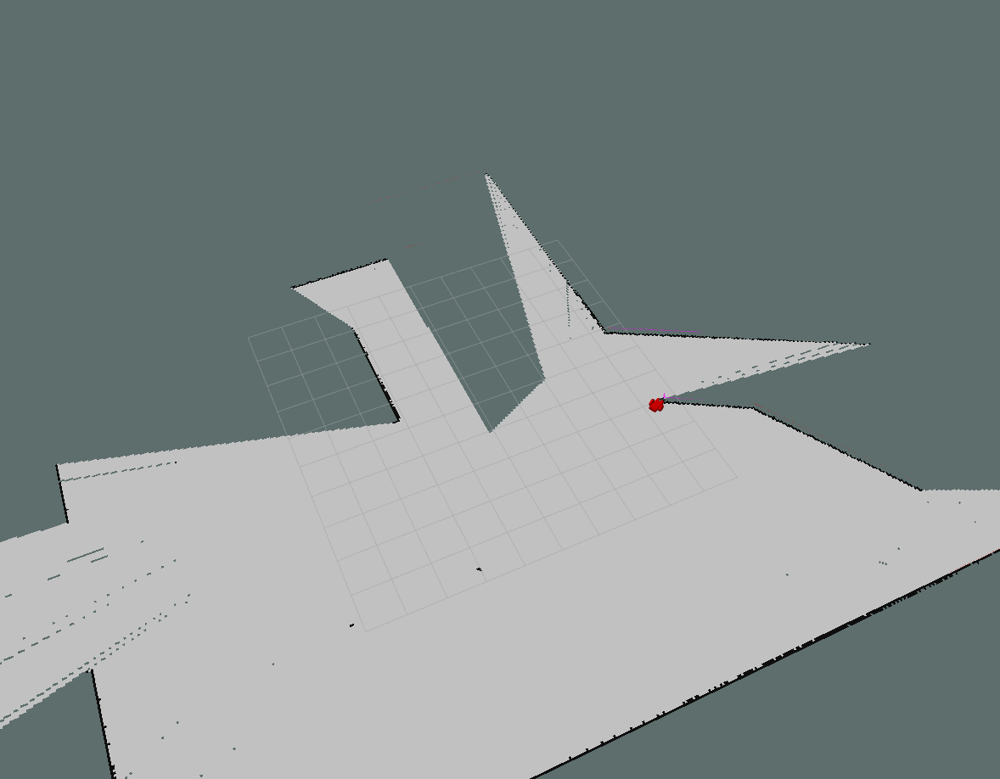
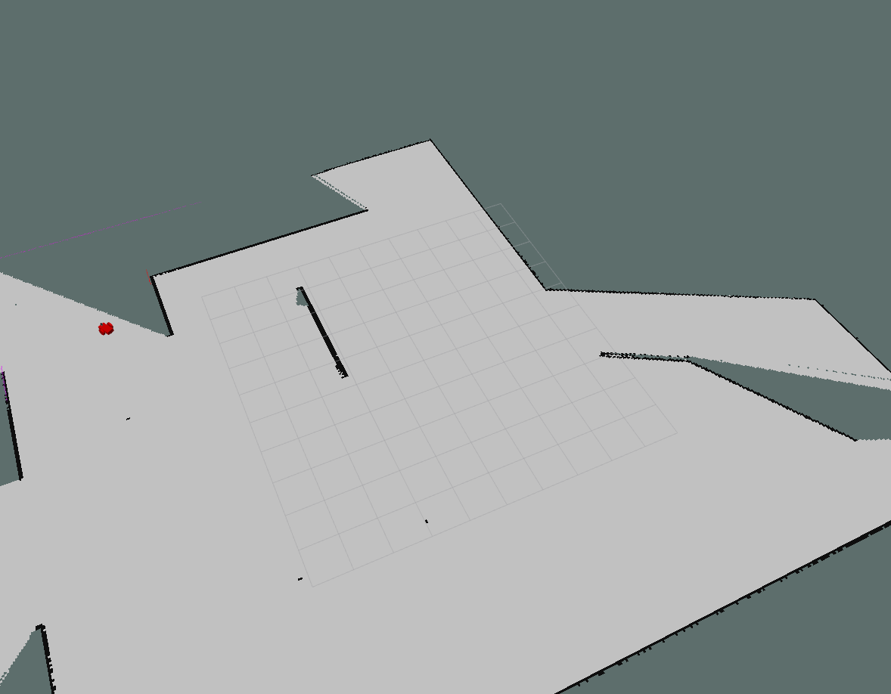

# Fast SLAM with gmap library in ROS

Grid-based FastSLAM with laser scanner equipped robot by using gmap library


### Prerequisites

Ubuntu 16.04 and ROS kinetic

## Run

1. Delete build folder and catkin_make
```
$ cd "root folder"
$ catkin make
$ source devel/setup.bash
$ roslaunch my_robot myworld.launch
```
2. Create another terminal and open the teleop node
```
$ cd "root folder"
$ source devel/setup.bash
$ rosrun teleop_twist_kop_twist_keyboard.py
```
3. Create another terminal and open the gmap node
```
$ cd "root folder"
$ source devel/setup.bash
$ rosrun gmappingslam_gmapping scan:=scan _base_frame:=odom
```
4. Move the robot and mapping the world!

## Result

### Step 1


### Step 2


